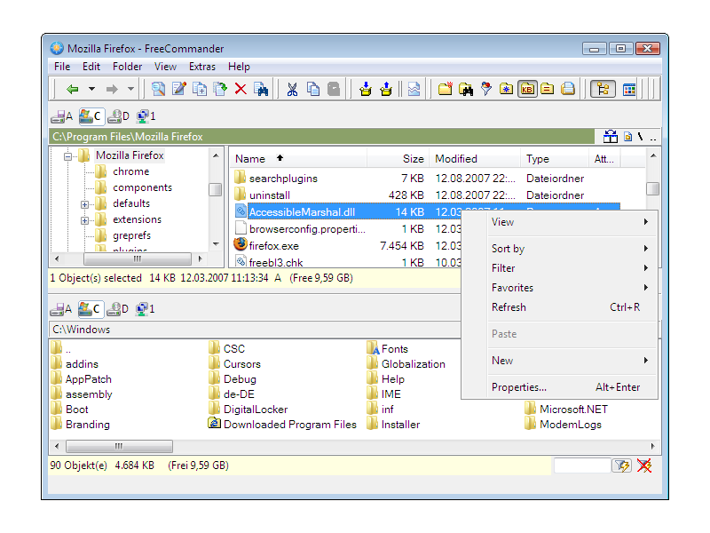
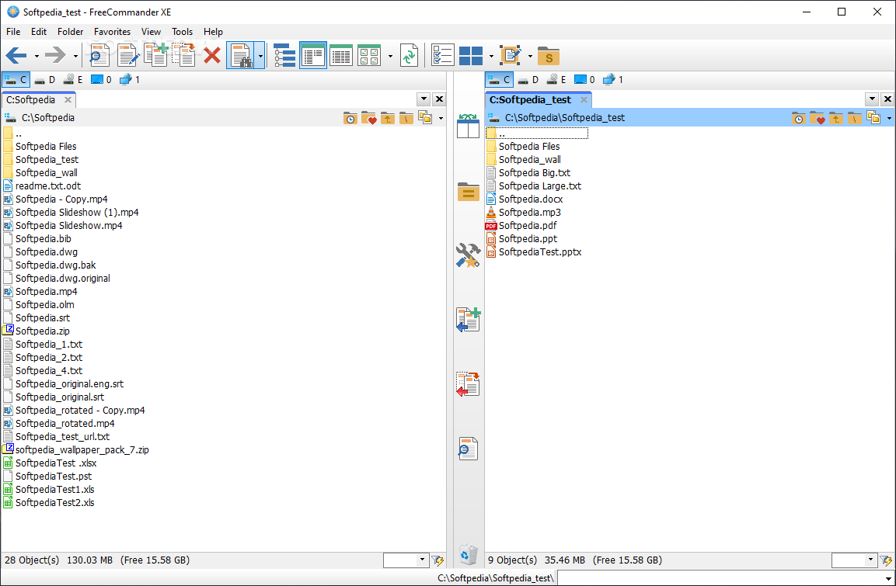

# FreeCommander XE - Fast Portable Dual-Panel File Manager For Windows

FreeCommander XE is a customizable Windows file manager maintained in the FreeCommander Portable organization. It provides two folder panes, tabbed browsing, portable operation, file previews, archive handling, folder synchronization, duplicate detection, and bulk renaming.

> FreeCommander XE keeps everyday file operations visible, portable, and easy to control.

## Features

- Dual-panel browsing with side-by-side or vertically arranged folders.
- Independent tabs in both panels.
- Portable settings suitable for removable storage.
- Copy, move, rename, delete, and clipboard operations.
- ZIP and RAR archive handling.
- Text, image, hexadecimal, and binary file previews.
- Folder comparison and synchronization.
- Duplicate file detection.
- Multi-file rename workflows.
- Search by file name and attributes.
- Customizable keyboard shortcuts and interface options.
- Dark interface support for FreeCommander dark mode workflows.
- Compatibility with Windows 10 and Windows 11.
- Support for 32-bit and 64-bit Windows systems.

## Latest Builds

| Edition | Platform | Purpose |
|---|---|---|
| FreeCommander XE | Windows 32-bit | Compatibility with 32-bit Windows systems |
| FreeCommander XE 64 Bit | Windows 64-bit | Native operation on modern 64-bit systems |
| FreeCommander Portable | Windows | Portable use without mandatory installation |

## Requirements

| Component | Requirement |
|---|---|
| Operating system | Windows XP through Windows 11 |
| Architectures | 32-bit and 64-bit |
| Interface | Native Windows desktop |
| Portable operation | A writable folder or removable drive |
| Build environment | Visual Studio with C++ desktop development support |

FreeCommander Windows 10 users can run the application as a conventional desktop file manager. FreeCommander Windows 11 users receive the same dual-pane, tab, navigation, and file-operation model without depending on the simplified File Explorer workflow.

## Where To Start

FreeCommander Portable is intended for users who want to keep program files and settings together. FreeCommander XE can also be used as a regular desktop application for managing local drives, removable media, folders, and archives.

The repository keeps the main Visual Studio solution in [Explorer++.sln](Explorer++.sln). The historical Explorer++ filenames remain in the selected source tree for build compatibility, while FreeCommander Portable and FreeCommander XE identify this repository and application.

### Is FreeCommander free?

FreeCommander is available without charge for personal and educational use. Commercial users should review the applicable donor-license terms before deploying FreeCommander XE in a business environment. The repository license is documented separately in [LICENSE](LICENSE), and application distribution terms should not be inferred solely from the source-code license.

FreeCommander Portable does not require a conventional installation merely to run from a writable directory or USB drive. Some editions or builds may have different availability, so users should verify that the selected FreeCommander 64 bit package matches their permitted use.

### How can I download Total Commander for free?

This repository does not distribute Total Commander, modified copies, license keys, or unofficial packages. Total Commander should only be obtained through its authorized distribution channels and used under its own trial or paid-license terms.

Users seeking a permanently available option can instead evaluate FreeCommander XE. FreeCommander Portable supplies a two-panel workflow, tabs, archive support, previews, synchronization, and bulk file operations without presenting itself as a copy of another product.

### What are some free alternatives to Total Commander for Windows?

FreeCommander XE is a strong option for Windows users who need dual panels, tabs, portable operation, archive handling, previews, synchronization, and multi-rename support. FreeCommander Portable is especially suitable when settings must travel with the program.

Other source projects represented in the research include Double Commander, Explorer++, Windows File Manager, Files, and Sigma File Manager. They differ in platform support, interface design, extensibility, and maintenance model. Users should compare those characteristics with the focused Windows workflow provided by the FreeCommander dual pane file manager.

## FreeCommander XE At A Glance

freecommander xe, freecommander file manager, freecommander portable, freecommander dual pane file manager, freecommander windows 11, freecommander multi rename, file-manager, windows, dual-pane, portable-app, file-explorer, folder-management, desktop-application

## Building FreeCommander XE

The build starts with [Explorer++.sln](Explorer++.sln), which loads the main project from [Explorer++.vcxproj](Explorer++.vcxproj). Visual Studio uses [Explorer++.vcxproj.filters](Explorer++.vcxproj.filters) to organize the source tree.

Repository-wide formatting is defined in [.clang-format](.clang-format) and [.editorconfig](.editorconfig). Packaging and Windows metadata are represented by [Explorer++.exe.manifest](Explorer++.exe.manifest) and [Explorer++.rc](Explorer++.rc).

Detailed build guidance is maintained in [BUILDING.md](BUILDING.md).

### Build Structure

MSBuild evaluates project configuration before compiling the selected source files and linking the desktop executable. Architecture, compiler, resource, and manifest settings belong in the project configuration, while behavior specific to FreeCommander XE belongs in the corresponding C++ implementation.

| Area | Representative Files |
|---|---|
| Application startup | [src/Main.cpp](src/Main.cpp), [src/Application.cpp](src/Application.cpp) |
| Window management | [src/BrowserWindow.cpp](src/BrowserWindow.cpp), [src/BrowserWindowFactoryImpl.cpp](src/BrowserWindowFactoryImpl.cpp) |
| Dual-pane browsing | [src/BrowserPane.cpp](src/BrowserPane.cpp), [src/BrowserView.cpp](src/BrowserView.cpp) |
| Address navigation | [src/AddressBar.cpp](src/AddressBar.cpp), [src/NavigationManager.cpp](src/NavigationManager.cpp) |
| Tabs | [src/Tab.cpp](src/Tab.cpp), [src/TabContainer.cpp](src/TabContainer.cpp), [src/TabView.cpp](src/TabView.cpp) |
| File operations | [src/FileOperations.cpp](src/FileOperations.cpp), [src/DirectoryOperationsHelper.cpp](src/DirectoryOperationsHelper.cpp) |
| Clipboard integration | [src/Clipboard.cpp](src/Clipboard.cpp), [src/ClipboardOperations.cpp](src/ClipboardOperations.cpp) |
| Drive monitoring | [src/DriveEnumeratorImpl.cpp](src/DriveEnumeratorImpl.cpp), [src/DriveWatcherImpl.cpp](src/DriveWatcherImpl.cpp) |
| Search | [src/SearchDialog.cpp](src/SearchDialog.cpp) |
| Bulk rename | [src/MassRenameDialog.cpp](src/MassRenameDialog.cpp), [src/MassRenameHelper.cpp](src/MassRenameHelper.cpp) |
| Settings | [src/OptionsDialog.cpp](src/OptionsDialog.cpp) |

## Documentation

The FreeCommander tutorial path begins with [Readme.txt](Readme.txt), followed by the build instructions in [BUILDING.md](BUILDING.md). Release-level changes are recorded in [CHANGELOG.md](CHANGELOG.md).

A FreeCommander review should consider the two-panel workflow, tab handling, portable settings, navigation, file previews, archive support, and keyboard-driven operations. FreeCommander XE 2026 documentation should also distinguish application behavior from repository build details.

## What It Looks Like

FreeCommander XE presents two independently navigable folder panes inside a native Windows desktop window. Tabs keep multiple directories available, while the address bar, drive controls, search dialog, and operation dialogs provide direct access to common tasks.

The FreeCommander file manager layout is designed for moving and comparing files without repeatedly opening separate windows. FreeCommander dark mode can reduce visual contrast while preserving the same controls and navigation model.

## Tests

The selected test suite covers application startup, windows, tabs, navigation, clipboard behavior, file selection, filesystem monitoring, drive enumeration, and multi-rename helpers.

| Area | Test |
|---|---|
| Application | [tests/ApplicationTest.cpp](tests/ApplicationTest.cpp) |
| Address bar | [tests/AddressBarTest.cpp](tests/AddressBarTest.cpp) |
| Browser window | [tests/BrowserWindowTest.cpp](tests/BrowserWindowTest.cpp) |
| Shell browser | [tests/ShellBrowserTest.cpp](tests/ShellBrowserTest.cpp) |
| Tabs | [tests/TabTest.cpp](tests/TabTest.cpp), [tests/TabContainerTest.cpp](tests/TabContainerTest.cpp), [tests/TabViewTest.cpp](tests/TabViewTest.cpp) |
| Navigation | [tests/NavigationManagerTest.cpp](tests/NavigationManagerTest.cpp), [tests/NavigationRequestTest.cpp](tests/NavigationRequestTest.cpp) |
| Clipboard | [tests/ClipboardTest.cpp](tests/ClipboardTest.cpp) |
| File selection | [tests/FileSelectionTests.cpp](tests/FileSelectionTests.cpp) |
| Filesystem monitoring | [tests/FileSystemWatcherTest.cpp](tests/FileSystemWatcherTest.cpp) |
| Drive enumeration | [tests/DriveEnumeratorImplTest.cpp](tests/DriveEnumeratorImplTest.cpp) |
| Multi-rename | [tests/MassRenameHelperTest.cpp](tests/MassRenameHelperTest.cpp) |

## Contributing To FreeCommander XE

Contributions to FreeCommander Portable should begin with [CONTRIBUTING.md](CONTRIBUTING.md). Proposed changes should remain focused, compile for the supported Windows targets, and include relevant tests.

Bug fixes should explain the affected workflow and expected result. Larger changes to navigation, file operations, synchronization, FreeCommander duplicate finder behavior, or FreeCommander multi rename behavior should describe their user-facing impact before implementation.

## Comparison To Other Tools

| Capability | FreeCommander XE |
|---|:---:|
| Native Windows desktop interface | Yes |
| Dual-panel navigation | Yes |
| Tabs in file panels | Yes |
| Portable operation | Yes |
| Folder synchronization | Yes |
| Archive handling | Yes |
| File previews | Yes |
| Duplicate finder | Yes |
| Multi-rename | Yes |
| Dark mode | Yes |
| 32-bit support | Yes |
| 64-bit support | Yes |

FreeCommander XE emphasizes direct folder management rather than media analysis or specialized cleanup. Its FreeCommander synchronize folders workflow, FreeCommander duplicate finder, and FreeCommander multi rename features complement the core dual-panel interface.

## How To Help

- Report reproducible problems with clear Windows and architecture details.
- Add focused tests for corrected behavior.
- Keep C++ changes consistent with the existing source organization.
- Update [CHANGELOG.md](CHANGELOG.md) when behavior changes.
- Review security-sensitive file and shell operations carefully.
- Keep FreeCommander Portable behavior reliable on writable removable storage.

## AI Policy

Contributions created with automated assistance must meet the same quality requirements as manually written changes. Contributors must understand the submitted code, explain its behavior, and verify it with relevant tests. Generated changes that cannot be reviewed or maintained should not be submitted.

## Security

Security issues involving file operations, path handling, clipboard data, archives, privileges, or shell integration should follow [SECURITY.md](SECURITY.md). Reports should avoid exposing sensitive user data or destructive reproduction steps in public discussions.

## License

Repository licensing information is available in [LICENSE](LICENSE). FreeCommander XE application-use terms, donor-edition access, and repository source licensing may represent separate obligations.
